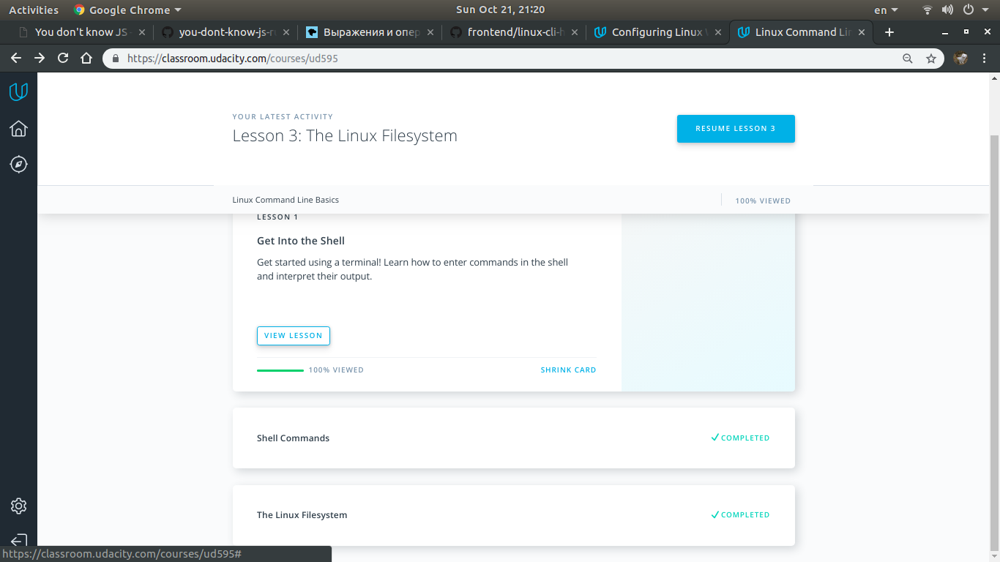

# kottans-frontend

#### TASK 0

For me, it became new to use pull/fetch with parameters. I also discovered a "cherry-pick" command, and how effective and simple it is.
I was surprised at how simple I can change the order of commits.
I'm going to use  "cherry-pick", a "pull" with the --rebase, and HEAD with syntax to switch between commits

#### TASK 1

1. Linux Command Line Basics
