## Git and GitHub

For me, it became new to use pull/fetch with parameters. I also discovered a "cherry-pick" command, and how effective and simple it is.
I was surprised at how simple I can change the order of commits.
I'm going to use  "cherry-pick", a "pull" with the --rebase, and HEAD with syntax to switch between commits.

## Linux CLI, and HTTP

In this lesson, I repeated the basic cli commands,how to change permissions for files and folders. Also, I known a lot of information about HTTP, and protocol layers interaction principle.

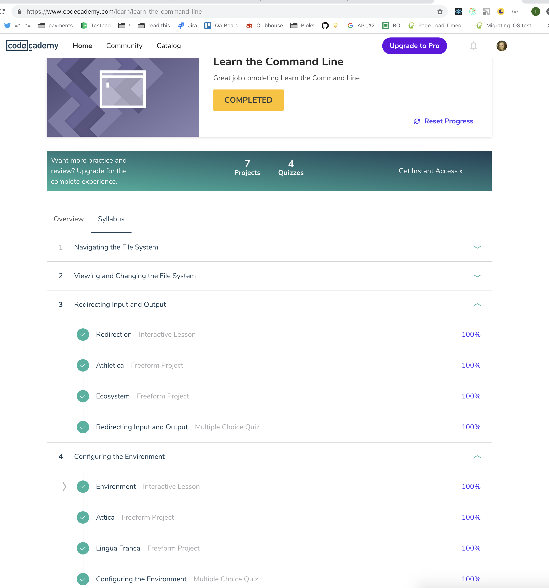

## Git Collaboration

I repeated the basics of brunching, committing and collaboration.

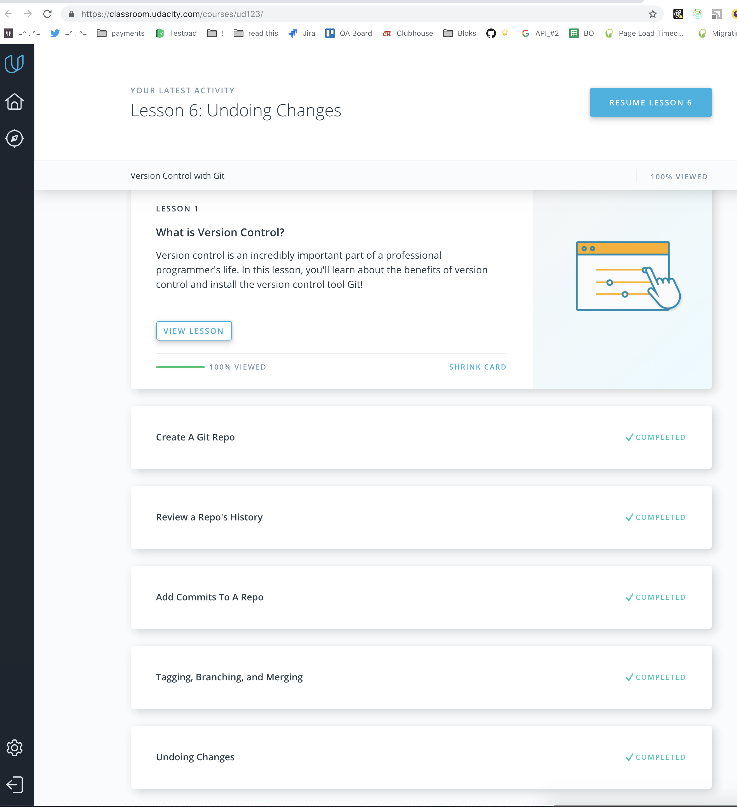
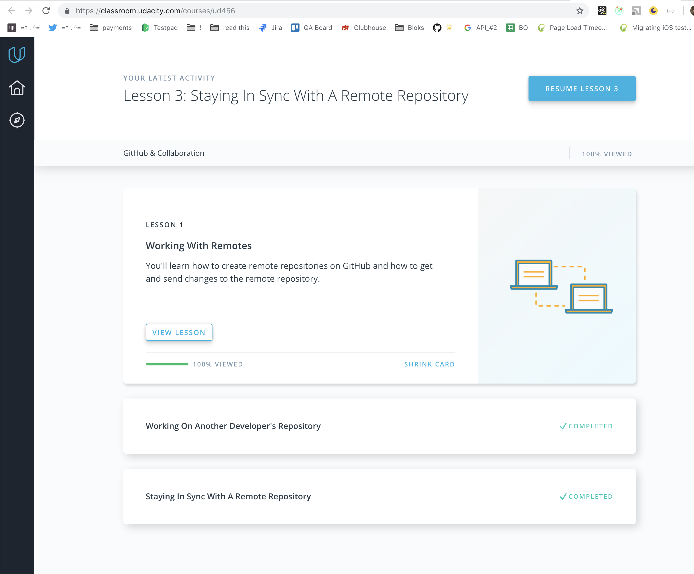

## Intro to HTML and CSS

I learned about the calculation of specificity, how to correctly form selectors, pseudoclashes.

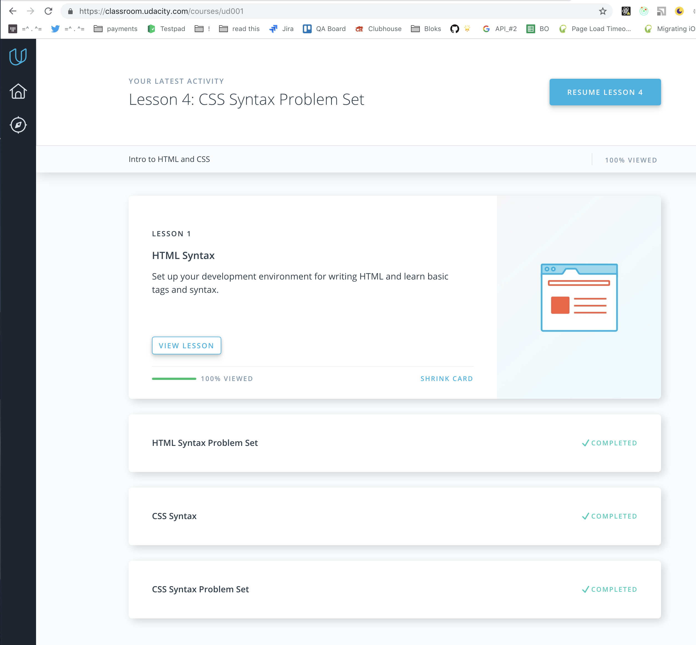
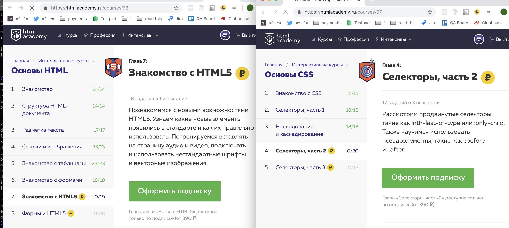

## Responsive Web Design

I learned about the specificity of selectors, responsive design and patterns, media queries, and how easy it is to manipulate elements on the page using grid-based layouts.

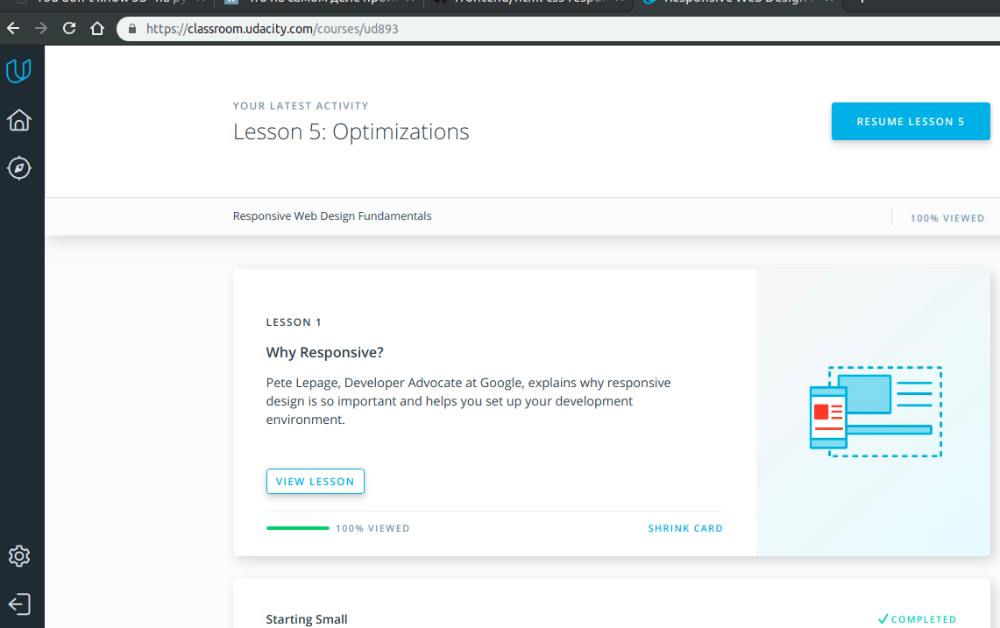
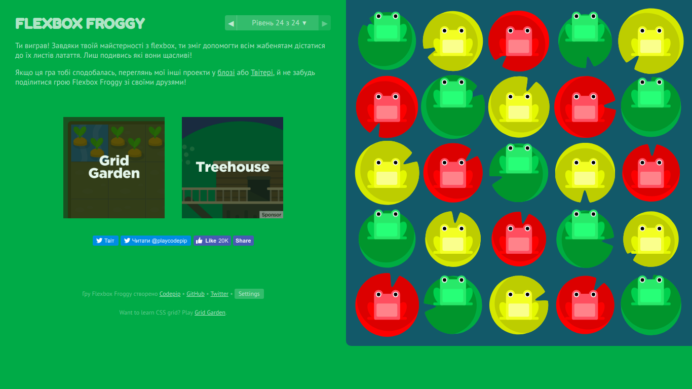

## JS Basics

I learned about the properties and methods of Array, String, Object and get acquainted with a special object -  argument.
I began to better understand how to work with stack, queue, various sorting. New for me was working with linked lists, graphs, trees.

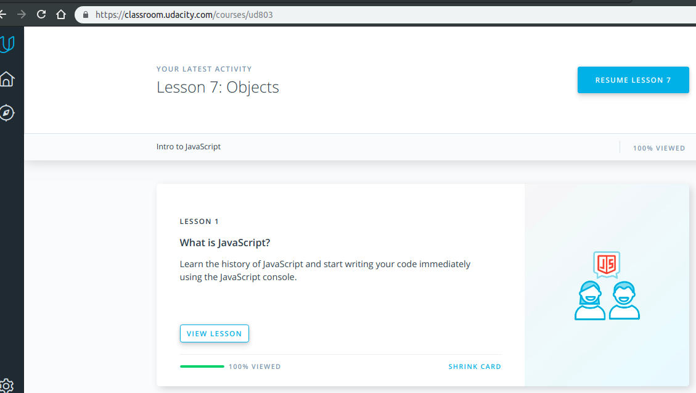
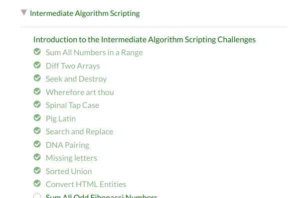
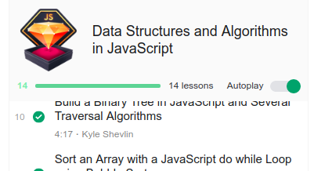

## DOM

I deepened my knowledge about object Document and its methods, learned how browser events work, and became acquainted with the performance.now () method.

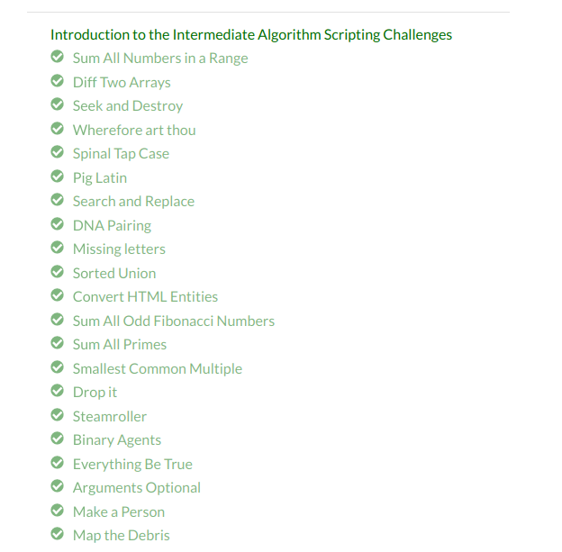

[Code base ](https://github.com/IrynaY/test) Reviewed and approved by @zonzujiro, @mgdskr

New for me was Element.classList property, reminded event delegation
I will use the ability to add all the necessary elements to the page at once, and not in a cycle, also save similar items in Array

## A Tiny JS World

[Code base](https://github.com/IrynaY/a-tiny-JS-world/blob/populate-world/index.js) Reviewed and approved by @OleksiyRudenko

I learned the nuances of copying objects in JS, the basic principles of OOP (abstraction, inheritance, encapsulation, polymorphism) and how they work in JS .

## Object Oriented JS

[Ccodewars](https://www.codewars.com/users/Murinis28)

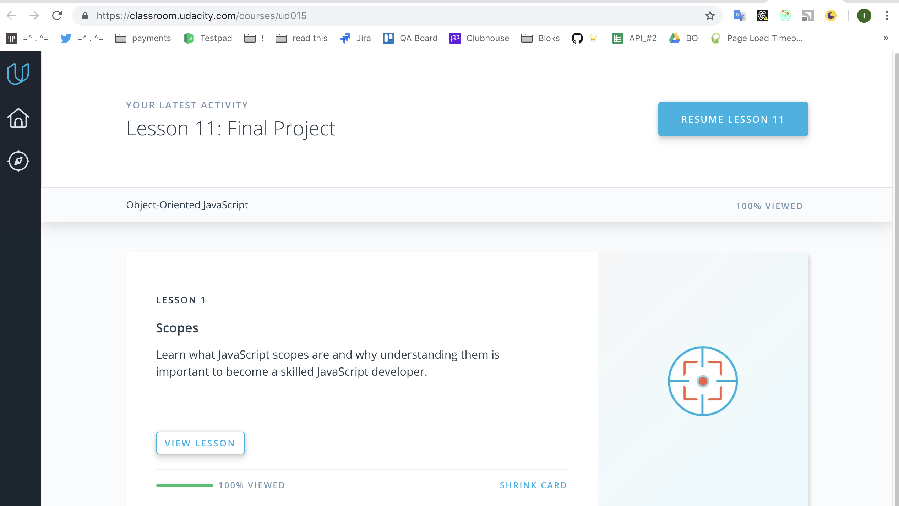

<!-- [Code base ](https://github.com/IrynaY/frontend-nanodegree-arcade-game) Reviewed and approved by @ -->

I learned about scopes, closures, 'this' keyword, prototype chains,and I have learned that JS can have functional, prototypical and pseudo-class OOP styles.

## OOP Exercise

In this practical assignment, I improved my knowledge of OOP js and learned, saw the difference in use between prototypes and classes.

[Code base ](https://github.com/IrynaY/a-tiny-JS-world/blob/master/index.js) Reviewed and approved by @OleksiyRudenko
<!-- https://github.com/kottans/frontend-2019-homeworks/pull/54 -->

## Offline Web Applications

I learned how to describe the correct behavior of the web application offline, intercept network requests and cache data.
For me  was new use service worker, IndexDB. I also learned more features of ChromeDevTools, network and http2 protocol.

<!-- ## Memory Pair Game

[Code base ](https://github.com/IrynaY/a-tiny-JS-world/blob/master/index.js) Reviewed and approved by @ -->
